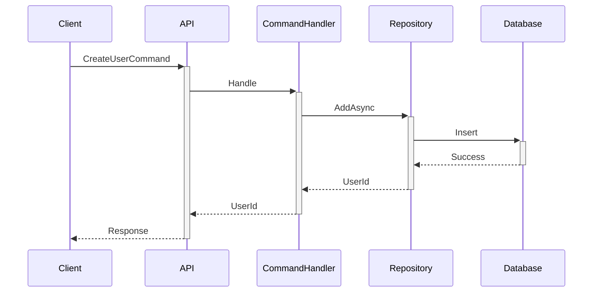

# 开发工具推荐

## 概述

选择合适的开发工具可以显著提高开发效率和代码质量。本文档推荐一系列在DDD和Clean Architecture项目中常用的开发工具。

## 集成开发环境（IDE）

### Visual Studio 2022

**官网**: [https://visualstudio.microsoft.com/](https://visualstudio.microsoft.com/)

**优势**:
- 完整的.NET开发支持
- 强大的调试工具
- 内置数据库工具
- Resharper集成
- 优秀的重构支持

**推荐版本**: Professional或Enterprise

**必备插件**:
- ReSharper - 代码分析和重构
- SonarLint - 代码质量检查
- CodeMaid - 代码清理
- Productivity Power Tools - 生产力增强

### JetBrains Rider

**官网**: [https://www.jetbrains.com/rider/](https://www.jetbrains.com/rider/)

**优势**:
- 跨平台支持
- 内置ReSharper功能
- 性能优秀
- 强大的代码导航
- 优秀的调试体验

**推荐使用场景**:
- macOS或Linux开发
- 追求性能和响应速度
- 喜欢JetBrains系列工具

### Visual Studio Code

**官网**: [https://code.visualstudio.com/](https://code.visualstudio.com/)

**优势**:
- 轻量级
- 丰富的扩展生态
- 跨平台
- 快速启动
- 强大的Git集成

**推荐扩展**:
- C# Dev Kit - C#开发支持
- GitLens - Git增强
- REST Client - API测试
- Docker - 容器支持
- ESLint - 代码规范

## 数据库工具

### Azure Data Studio

**官网**: [https://azure.microsoft.com/en-us/products/data-studio](https://azure.microsoft.com/en-us/products/data-studio)

**特点**:
- 跨平台SQL Server工具
- 现代化界面
- 扩展支持
- Notebook支持

### DBeaver

**官网**: [https://dbeaver.io/](https://dbeaver.io/)

**特点**:
- 支持多种数据库
- 免费开源
- ER图生成
- 数据导入导出

### SQL Server Management Studio (SSMS)

**官网**: [https://docs.microsoft.com/en-us/sql/ssms/](https://docs.microsoft.com/en-us/sql/ssms/)

**特点**:
- SQL Server专用工具
- 功能全面
- 查询优化建议
- 性能监控

## API开发与测试

### Postman

**官网**: [https://www.postman.com/](https://www.postman.com/)

**功能**:
- API请求测试
- 集合管理
- 环境变量
- 自动化测试
- 文档生成

**使用建议**:
- 为每个项目创建Collection
- 使用环境变量管理不同环境
- 编写测试脚本进行自动化测试

### Swagger/OpenAPI

**集成方式**:
```csharp
// Program.cs
builder.Services.AddEndpointsApiExplorer();
builder.Services.AddSwaggerGen(c =>
{
    c.SwaggerDoc("v1", new OpenApiInfo 
    { 
        Title = "My API", 
        Version = "v1" 
    });
});

var app = builder.Build();

if (app.Environment.IsDevelopment())
{
    app.UseSwagger();
    app.UseSwaggerUI();
}
```

**特点**:
- 自动生成API文档
- 在线测试接口
- 客户端代码生成

### REST Client (VS Code Extension)

**特点**:
- 在代码编辑器中测试API
- 支持.http文件
- 版本控制友好

**示例**:
```http
### 创建用户
POST https://localhost:5001/api/users
Content-Type: application/json

{
  "name": "张三",
  "email": "zhangsan@example.com"
}

### 获取用户列表
GET https://localhost:5001/api/users?pageIndex=1&pageSize=20
```

## 版本控制

### Git

**官网**: [https://git-scm.com/](https://git-scm.com/)

**必备技能**:
- 基本命令: add, commit, push, pull
- 分支管理: branch, merge, rebase
- 冲突解决
- 标签管理

**推荐Git工作流**:
- Git Flow - 适合发布周期明确的项目
- GitHub Flow - 适合持续部署的项目
- Trunk Based Development - 适合高频部署

### GitHub Desktop

**官网**: [https://desktop.github.com/](https://desktop.github.com/)

**特点**:
- 图形化Git客户端
- 简单易用
- 适合Git新手

### SourceTree

**官网**: [https://www.sourcetreeapp.com/](https://www.sourcetreeapp.com/)

**特点**:
- 强大的可视化
- 支持Git Flow
- 交互式变基

## 容器与编排

### Docker Desktop

**官网**: [https://www.docker.com/products/docker-desktop/](https://www.docker.com/products/docker-desktop/)

**用途**:
- 本地开发环境
- 数据库容器
- 微服务测试
- CI/CD集成

**示例Dockerfile**:
```dockerfile
FROM mcr.microsoft.com/dotnet/aspnet:8.0 AS base
WORKDIR /app
EXPOSE 80

FROM mcr.microsoft.com/dotnet/sdk:8.0 AS build
WORKDIR /src
COPY ["MyProject.Web/MyProject.Web.csproj", "MyProject.Web/"]
RUN dotnet restore "MyProject.Web/MyProject.Web.csproj"
COPY . .
WORKDIR "/src/MyProject.Web"
RUN dotnet build "MyProject.Web.csproj" -c Release -o /app/build

FROM build AS publish
RUN dotnet publish "MyProject.Web.csproj" -c Release -o /app/publish

FROM base AS final
WORKDIR /app
COPY --from=publish /app/publish .
ENTRYPOINT ["dotnet", "MyProject.Web.dll"]
```

### Docker Compose

**用途**:
- 多容器应用编排
- 本地开发环境

**示例docker-compose.yml**:
```yaml
version: '3.8'

services:
  api:
    build: .
    ports:
      - "5000:80"
    environment:
      - ASPNETCORE_ENVIRONMENT=Development
      - ConnectionStrings__DefaultConnection=Server=db;Database=MyProjectDb;User=sa;Password=Your_password123;
    depends_on:
      - db

  db:
    image: mcr.microsoft.com/mssql/server:2022-latest
    environment:
      - ACCEPT_EULA=Y
      - SA_PASSWORD=Your_password123
    ports:
      - "1433:1433"
    volumes:
      - sqldata:/var/opt/mssql

volumes:
  sqldata:
```

## 性能分析

### dotnet-counters

**安装**:
```bash
dotnet tool install --global dotnet-counters
```

**使用**:
```bash
# 监控应用性能
dotnet-counters monitor --process-id <PID>
```

### dotnet-trace

**安装**:
```bash
dotnet tool install --global dotnet-trace
```

**使用**:
```bash
# 收集性能追踪
dotnet-trace collect --process-id <PID>
```

### MiniProfiler

**NuGet包**:
```bash
dotnet add package MiniProfiler.AspNetCore.Mvc
```

**配置**:
```csharp
builder.Services.AddMiniProfiler(options =>
{
    options.RouteBasePath = "/profiler";
}).AddEntityFramework();

app.UseMiniProfiler();
```

## 日志与监控

### Serilog

**NuGet包**:
```bash
dotnet add package Serilog.AspNetCore
dotnet add package Serilog.Sinks.Console
dotnet add package Serilog.Sinks.File
```

**配置**:
```csharp
builder.Host.UseSerilog((context, configuration) =>
{
    configuration
        .ReadFrom.Configuration(context.Configuration)
        .Enrich.FromLogContext()
        .WriteTo.Console()
        .WriteTo.File("logs/log-.txt", rollingInterval: RollingInterval.Day);
});
```

### Seq

**官网**: [https://datalust.co/seq](https://datalust.co/seq)

**特点**:
- 结构化日志查询
- 实时日志查看
- 强大的过滤和搜索

### Application Insights

**官网**: [https://azure.microsoft.com/en-us/products/monitor/](https://azure.microsoft.com/en-us/products/monitor/)

**特点**:
- Azure集成
- 应用性能监控
- 分布式追踪
- 异常跟踪

## 代码质量

### SonarQube

**官网**: [https://www.sonarsource.com/products/sonarqube/](https://www.sonarsource.com/products/sonarqube/)

**功能**:
- 代码质量分析
- 安全漏洞检测
- 技术债务评估
- 代码覆盖率

### ReSharper

**官网**: [https://www.jetbrains.com/resharper/](https://www.jetbrains.com/resharper/)

**功能**:
- 代码分析
- 快速重构
- 代码生成
- 导航增强

### StyleCop

**NuGet包**:
```bash
dotnet add package StyleCop.Analyzers
```

**配置**:
```xml
<!-- .editorconfig -->
[*.cs]
dotnet_diagnostic.SA1633.severity = none # 文件头注释
dotnet_diagnostic.SA1200.severity = none # Using指令位置
```

## 测试工具

### xUnit

**NuGet包**:
```bash
dotnet add package xunit
dotnet add package xunit.runner.visualstudio
```

### Moq

**NuGet包**:
```bash
dotnet add package Moq
```

### FluentAssertions

**NuGet包**:
```bash
dotnet add package FluentAssertions
```

**示例**:
```csharp
user.Name.Should().Be("张三");
user.Email.Should().NotBeNullOrEmpty();
users.Should().HaveCount(10);
```

### Coverlet

**NuGet包**:
```bash
dotnet add package coverlet.collector
```

**使用**:
```bash
dotnet test /p:CollectCoverage=true /p:CoverletOutputFormat=opencover
```

## 文档生成

### DocFX

**官网**: [https://dotnet.github.io/docfx/](https://dotnet.github.io/docfx/)

**特点**:
- API文档生成
- Markdown支持
- 自定义主题

### Mermaid

**官网**: [https://mermaid.js.org/](https://mermaid.js.org/)

**用途**:
- 流程图
- 序列图
- 类图
- ER图

**示例**:


## CI/CD工具

### GitHub Actions

**示例工作流**:
```yaml
name: .NET Build and Test

on:
  push:
    branches: [ main ]
  pull_request:
    branches: [ main ]

jobs:
  build:
    runs-on: ubuntu-latest
    
    steps:
    - uses: actions/checkout@v3
    - name: Setup .NET
      uses: actions/setup-dotnet@v3
      with:
        dotnet-version: 8.0.x
    - name: Restore dependencies
      run: dotnet restore
    - name: Build
      run: dotnet build --no-restore
    - name: Test
      run: dotnet test --no-build --verbosity normal
```

### Azure DevOps

**特点**:
- 完整的DevOps平台
- 工作项管理
- 源代码管理
- CI/CD管道

### Jenkins

**特点**:
- 开源免费
- 丰富的插件
- 高度可定制

## 开发效率工具

### LINQPad

**官网**: [https://www.linqpad.net/](https://www.linqpad.net/)

**用途**:
- LINQ查询测试
- C#代码片段运行
- 数据库查询

### .NET Interactive Notebooks

**安装**:
```bash
dotnet tool install -g Microsoft.dotnet-interactive
```

**用途**:
- 交互式代码执行
- 文档和代码结合
- 数据分析

### Snippet Generator

**用途**:
- 创建代码片段
- 提高编码效率

## 推荐工具组合

### 个人开发者

- IDE: Visual Studio Code或Rider
- API测试: REST Client
- 数据库: Azure Data Studio
- 版本控制: GitHub Desktop
- 容器: Docker Desktop

### 团队开发

- IDE: Visual Studio 2022或Rider
- API测试: Postman
- 数据库: SQL Server Management Studio
- 版本控制: Git + SourceTree
- CI/CD: GitHub Actions
- 代码质量: SonarQube
- 日志: Serilog + Seq

### 企业级项目

- IDE: Visual Studio 2022 Enterprise
- API网关: Kong或Ocelot
- 服务网格: Istio
- 监控: Application Insights
- 日志: ELK Stack
- CI/CD: Azure DevOps
- 代码质量: SonarQube

## 学习资源

### 在线课程

- Pluralsight - .NET相关课程
- Udemy - DDD和Clean Architecture
- Microsoft Learn - 官方学习平台

### 书籍推荐

- 《Domain-Driven Design》 - Eric Evans
- 《Implementing Domain-Driven Design》 - Vaughn Vernon
- 《Clean Architecture》 - Robert C. Martin
- 《Patterns, Principles, and Practices of Domain-Driven Design》

### 博客和网站

- Martin Fowler的博客
- Microsoft .NET Blog
- DDD Community
- Clean Coder Blog

## 相关文档

- [NetCorePal Framework](netcorepal-framework.md)
- [CAP4J Framework](cap4j-framework.md)
- [项目结构最佳实践](../best-practices/project-structure.md)
- [测试策略](../best-practices/testing-strategy.md)
